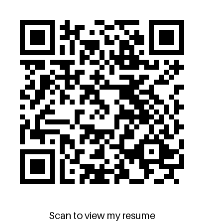

# QR Code Generator

This Python script generates a QR code that links to an online resume PDF. It also adds a text label below the QR code, prompting users to scan it to view the resume. The final image is saved as `qrcode.png`.

---

## Features

- **QR Code Generation**: Creates a QR code linking to a resume hosted online.
- **Customizable Text**: Adds a text label below the QR code (e.g., "Scan to view my resume").
- **Image Customization**: Allows customization of QR code colors and text font size.
- **Easy to Use**: Simple and straightforward script with minimal dependencies.

---

## Requirements

To run this script, you need the following Python libraries:

- `qrcode`
- `Pillow` (PIL)

You can install the required libraries using pip:

```bash
pip install qrcode[pil]
```

---

## Usage

1. Clone the repository:

```bash
git clone [https://github.com/your-username/qr-resume.git](https://github.com/mdislam1/qr-code-generator.git)
cd qr_code
```

2. Modify the script to update the resume link or customize the text and colors:

```python
qr.add_data('https://mdislam1.github.io/resume-host/Md_Islam_Resume.pdf')  # Replace with your resume link
text = "Scan to view my resume"  # Customize the text
```

3. Run the script:

```bash
python qr_code.py
```

4. The generated QR code image (`qrcode.png`) will be saved in the current directory and displayed on your screen.

---

## Example Output

The script generates an image like this:



---

## Customization

- **QR Code Colors**: Modify the `fill_color` and `back_color` parameters in the `qr.make_image()` function.
- **Text Font Size**: Adjust the `size` parameter in the `ImageFont.load_default()` function.
- **Text Content**: Change the `text` variable to display a different message.

---

## License

This project is licensed under the MIT License. See the [LICENSE](LICENSE) file for details.

---

## Contributing

Contributions are welcome! If you have any suggestions or improvements, feel free to open an issue or submit a pull request.

---

## Author

Md Islam  
GitHub: https://github.com/mdislam1

---

## Acknowledgments

- Thanks to the `qrcode` and `Pillow` libraries for making this project possible.
- Inspired by the need for a simple and professional way to share resumes digitally.

---

**Happy Coding!** 🚀
